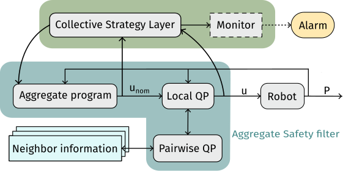

+++

title = "Toward a Collective Robotic Operating System"
description = "ACSOS 2026 PhD Symposium presentation"
outputs = ["Reveal"]

+++



@ ACSOS 2026 · PhD Symposium

# Towards Collective Robotic Operating Systems

Aggregate Computing for adaptive robot swarms

<strong>Angela Cortecchia</strong> 
Supervisor: Prof. Danilo Pianini  Co-supervisor: Prof. Mirko Viroli

<a href="mailto:angela.cortecchia@unibo.it">angela.cortecchia@unibo.it</a>

{}
Timing: 30 seconds. Introduce the research goal: make a swarm programmable and manageable as one adaptive system.
{}

---



The engineering problem

# A swarm keeps changing while it operates

{}
{}

A robotic collective must pursue a **system-level goal** with only local views and
**no centralized point of coordination**.

Robots are heterogeneous: they move, fail, join, and leave

Connectivity and sensing change at runtime

Unsafe transients can cause physical damage

The collective needs runtime support, not only a coordination algorithm.

{}
{}

{}
{}

{}
Timing: 55 seconds. Emphasize that mobility and failures change the computational structure during execution, and that there is nobody in the middle to re-plan for everyone. The operating layer must react while the robots remain physically safe.
{}

---



Programming abstraction

# One program for the whole collective

{}
{}

<strong>Usually, each robot is programmed individually</strong> — a common example is ROS.
With hundreds of robots, that does not scale.

With **Aggregate Computing** the collective is programmed as a whole, and the same
program runs decentralized on every device, which repeatedly:

1. senses local information;
2. exchanges data with its neighbors;
3. runs the same aggregate program;
4. acts on its local result.

Local executions compose into a global behavior.

{}
{}

One program, distributed execution, collective outcome

{}
{}

{}
Timing: 60 seconds. Open on the contrast: today the unit of programming is the robot, and it does not scale. Then computational fields as values distributed across devices. Aggregate Computing raises the abstraction level without introducing a central controller.
{}

---



Research gap

# Aggregate Computing programs the collective, but does not manage it

<h3>An aggregate application today</h3>

One collective program, deployed once

<ul>
<li>A single behavior runs on each device</li>
<li>No preemption, no lifecycle management</li>
<li>Self-stabilization guarantees recovery <em>eventually</em></li>
</ul>

<h3>What a robotic mission needs</h3>

Several behaviors, changing while the swarm flies

<ul>
<li>Concurrent applications on the same devices</li>
<li>An authorized operator that can stop or switch them</li>
<li>Constraints that hold <em>during</em> the transient</li>
</ul>

The runtime must manage computations whose membership and physical footprint change over time.

{}
Timing: 60 seconds. This is the gap the paper states: typical Aggregate Computing applications run one algorithm per device, with no preemption and no lifecycle for multiple collective applications, and eventual consistency is not enough when a transient state is already unsafe. Concrete example: surveillance drones that law enforcement must be able to stop or redirect mid-mission. The OS analogy is a design lens, not a claim that every traditional OS mechanism transfers directly.
{}

---



PhD research vision

# Lifting operating-system services to the collective

CROS

A <strong>Collective Robotic Operating System</strong> built on Aggregate Computing

Resource management
Structures and resources grow where the collective needs them
investigated

Monitoring
Collective state estimated from distributed, unreliable observations
investigated

Adaptation
Tasks redistributed at runtime when a device is lost
investigated

Shared state
Agreement between processes occupying different regions
investigated

Safety
Physical constraints enforced while the collective is still moving
investigated

Preemption &amp; lifecycle
Start, stop and switch collective processes without redeploying
open

Permissions
Who is authorized to change the behavior of the collective
open

How can reusable runtime mechanisms keep collective behavior manageable while robots, goals, and networks change?

{}
Timing: 65 seconds. Read the left column: these are the words an operating system already has, mapped onto a collective. Five have been investigated and the next slide shows them. Preemption and permissions are the two that Aggregate Computing does not offer at all today, and they are the reason this research exists: an authorized operator must be able to stop or redirect a swarm mid-mission.
{}

---



Investigated services &mdash; 1 of 3

# Organising the collective in space

<figure>

<figcaption><strong>Resource management</strong>FieldVMC
Structures grow, branch and repair from a local flow of resources, with no global blueprint.
Resources are routed towards the most successful area of the network: the shape is the outcome of a competition, not of a plan.
</figcaption>
</figure>
<figure>

<figcaption><strong>Adaptation</strong>Runtime replanning
A mission is assigned to the swarm; when a robot is lost, its tasks are redistributed among the survivors.
The plan is repaired by the collective while it operates, without re-running a global planner.
</figcaption>
</figure>

{}
Timing: 70 seconds. Two contributions, one minute of speaking. On FieldVMC insist on the second line: nobody designs the shape, it emerges from where the resources flow. On replanning insist that no planner is re-run: the swarm repairs its own plan while flying.
{}

---



Investigated services &mdash; 2 of 3

# Knowing what is happening, and agreeing on it

<figure>

<figcaption><strong>Monitoring</strong>Field-based distributed particle filtering
Several targets tracked from noisy observations, with observers that move and lose connectivity.
Where fusion happens, who leads, how far information travels: coordination is decoupled from the filtering logic, so it can be changed without redesigning the estimator.
</figcaption>
</figure>
<figure>

<figcaption><strong>Shared state</strong>Self-stabilizing min&ndash;max gossip
The best value in the network wins, and the collective converges to it from any state.
Each message carries the path of nodes that acknowledged it: that is what lets stale contributions be pruned, which classical min&ndash;max gossip cannot do.
</figcaption>
</figure>

{}
Timing: 70 seconds. On the DPF, the point is not the filter but the decoupling: the same estimator can be centralised, leader-based or fully decentralised by changing the coordination pattern. On the gossip, say plainly that monotonic min-max cannot retract a value once merged, and that the acknowledgement path is what makes retraction possible; it is proved self-stabilizing and shipped as a Collektive library.
{}

---



Investigated services &mdash; 3 of 3

# A safety filter between collective strategy and actuation

<strong>Aggregate program</strong> Computes the nominal swarm command <em>unom</em>

<strong>CLF/CBF safety filter</strong> Refines it into a feasible command <em>u</em> before actuation

<figure class="filter-demo">

<figcaption><strong>Dynamic leader election</strong>Connectivity preserved while separate clusters merge onto one leader</figcaption>
</figure>

<strong>Scope:</strong> proof-of-concept simulations; quantitative scalability and overhead remain future work. Collective strategy and physical safety stay separate concerns.

{}
Timing: 70 seconds. CLFs encode convergence objectives, CBFs encode safety constraints, and the local and pairwise quadratic programs run distributed. Keep it to the architecture and one scenario: clusters merge onto a common leader and the filter preserves the communication links while they do. The full treatment is the technical-track talk, and this is the place to invite people to it out loud. State the scope honestly.
{}

---



Wrap-up

# Takeaways and future work

Takeaways

<ul class="closing-list">
<li>For swarm missions the right unit of programming is the <strong>collective</strong>, not the robot;</li>
<li>Aggregate Computing gives that abstraction, but no way to <strong>manage</strong> what it runs;</li>
<li>Five operating-system services already have a decentralized mechanism behind them.</li>
</ul>

Future work

<ul class="closing-list">
<li>Combine spatial organization and safety: <strong>complex shapes that grow and move</strong> without unsafe transients;</li>
<li>Add the two missing services: <strong>preemption and lifecycle</strong>, and <strong>permissions</strong> over collective behavior;</li>
<li>Integrate the mechanisms into a <strong>CROS prototype</strong> in Collektive.</li>
</ul>

Personal portfolio

Make the swarm programmable as one system, while keeping its adaptation explicit and safe.

{}
Timing: 60 seconds. Read the takeaways, then the future work. On the second future-work point, say that preemption and permissions are the two rows left open in the vision map, and that aggregate processes already give a model for concurrent collective computations: what is missing is how such a process expands and contracts across space. The QR code is the personal portfolio, so point at it while inviting questions.
{}
