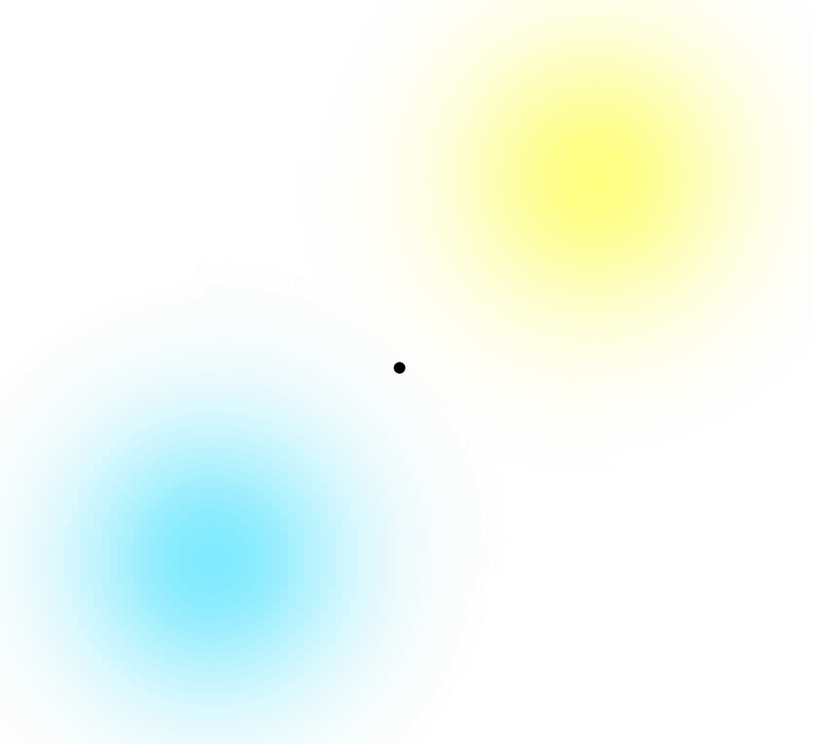
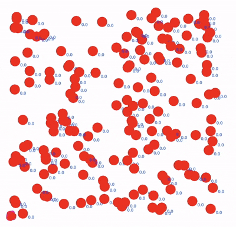
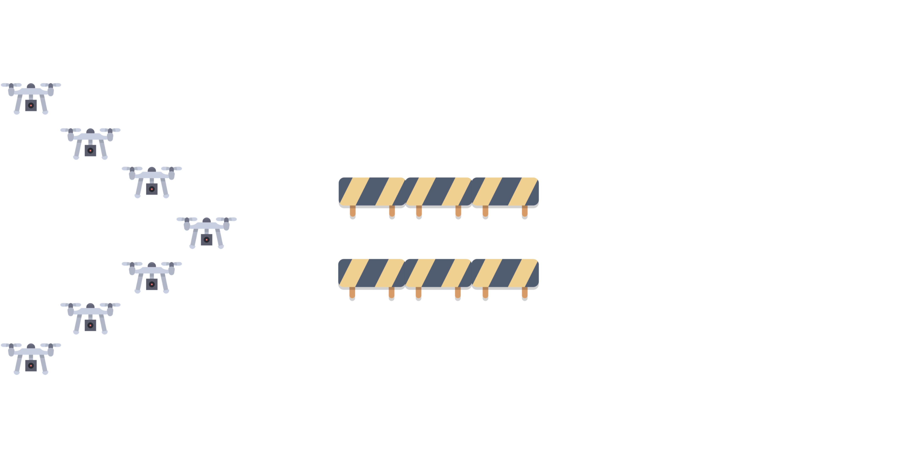

+++

title = "Toward a Collective Robotic Operating System"
description = "ACSOS 2026 PhD Symposium presentation"
outputs = ["Reveal"]

+++



ACSOS 2026 · PhD Symposium

# Toward a Collective Robotic Operating System

Aggregate Computing for adaptive robot swarms

<strong>Angela Cortecchia</strong> University of Bologna · DISI

{}
Timing: 30 seconds. Introduce the research goal: make a swarm programmable and manageable as one adaptive system.
{}

---



The engineering problem

# A swarm keeps changing while it operates

{}
{}

A robotic collective must pursue a **system-level goal** while each robot has only a local view.







The collective needs runtime support, not only a coordination algorithm.

{}
{}

{}
{}

{}
Timing: 50 seconds. Emphasize that mobility and failures change the computational structure during execution. The operating layer must react while the robots remain physically safe.
{}

---



Programming abstraction

# Aggregate Computing programs the collective

{}
{}

Each device repeatedly:

1. senses local information;
2. exchanges data with its neighbors;
3. runs the same aggregate program;
4. acts on its local result.

Local executions compose into a global behavior.

{}
{}

One program, distributed execution, collective outcome

{}
{}

{}
Timing: 55 seconds. Explain computational fields as values distributed across devices. Aggregate Computing raises the abstraction level without introducing a central controller.
{}

---



Research gap

# A programming model does not yet provide an operating layer

<h3>Traditional operating system</h3>

Runs processes on one machine

<ul>
<li>Lifecycle and preemption</li>
<li>Interprocess communication</li>
<li>Resource access</li>
</ul>

<h3>Collective counterpart</h3>

Runs aggregate processes across space

<ul>
<li>Distributed lifecycle management</li>
<li>Communication across regions</li>
<li>Collective sensing and actuation</li>
</ul>

The runtime must manage computations whose membership and physical footprint change over time.

{}
Timing: 55 seconds. Use the OS analogy as a design lens, not as a claim that every traditional OS mechanism transfers directly.
{}

---



PhD research vision

# Collective processes as the unit of management

CROS

A <strong>Collective Robotic Operating System</strong> built on Aggregate Computing

Concurrent applications
Runtime adaptation
Transient safety
Collective sensing
Resilient state

How can reusable runtime mechanisms keep collective behavior manageable while robots, goals, and networks change?

{}
Timing: 50 seconds. Present CROS as the long-term research vision. The capabilities form the evaluation dimensions for the incremental work.
{}

---



Progress so far

# Four building blocks for the operating layer

<figure>

<figcaption><strong>Spatial organization</strong>FieldVMC</figcaption>
</figure>
<figure>

<figcaption><strong>Runtime replanning</strong>Field-based missions</figcaption>
</figure>
<figure>

<figcaption><strong>Resilient state</strong>Self-stabilizing gossip</figcaption>
</figure>
<figure>

<figcaption><strong>Collective sensing</strong>Field-based DPF</figcaption>
</figure>

Each problem contributes a mechanism that can become part of a shared runtime.

{}
Timing: 65 seconds. Give one sentence per contribution. FieldVMC supports asynchronous organization. Replanning redistributes tasks. Gossip retracts obsolete state after faults. Field-based DPF separates estimation from coordination choices.
{}

---



Open problem

# Eventual recovery leaves a safety gap

{}
{}

Self-stabilizing programs guarantee recovery **after perturbations stop**.

During convergence, a robot may still:

- collide with another robot;
- hit an obstacle;
- break a required communication link.

Physical constraints must hold during adaptation.

{}
{}

The collective may still be reorganizing when a command reaches an actuator

{}
{}

{}
Timing: 60 seconds. Contrast eventual convergence with invariants that must hold at every instant. This motivates the paper's safety-filter architecture.
{}

---



Latest contribution

# Toward Safe Aggregate Computing

<strong>Aggregate program</strong> Computes the nominal swarm command <em>unom</em>

<strong>CLF/CBF safety filter</strong> Refines it into a feasible command <em>u</em> before actuation

Collective strategy and physical safety remain separate concerns.

{}
Timing: 80 seconds. Explain that CLFs encode convergence objectives and CBFs encode safety constraints. The local and pairwise quadratic programs run in a distributed fashion. The filter minimally modifies the nominal command when the active constraints are feasible.
{}

---



Proof of concept

# The filter preserves active constraints in simulation

<figure>

<figcaption><strong>Different targets</strong>Collision and obstacle avoidance</figcaption>
</figure>
<figure>

<figcaption><strong>Dynamic leader election</strong>Connectivity preservation</figcaption>
</figure>

<strong>Current scope:</strong> proof-of-concept simulations. Quantitative scalability and overhead evaluation remain future work.

{}
Timing: 70 seconds. Describe the two demonstrated scenarios. State the scope clearly: the paper shows feasibility in simulation and does not yet provide a quantitative performance evaluation.
{}

---



Next research step

# A shared runtime for managed collective adaptation

Integrate the building blocks into a runtime that can:

<ul class="closing-list">
<li>run and preempt multiple aggregate processes;</li>
<li>share state across dynamic regions;</li>
<li>switch strategies while preserving safety.</li>
</ul>

<strong>Planned extension:</strong> adaptive navigation policies that escape local minima, then resume the original objective.

Code and experiments

Make the swarm programmable as one system, while keeping its adaptation explicit and safe.

{}
Timing: 45 seconds. Close on the integration goal. Clarify that strategy switching around local minima is planned work, not a result of the current paper. Leave roughly 30 seconds of buffer within the 10-minute slot.
{}
